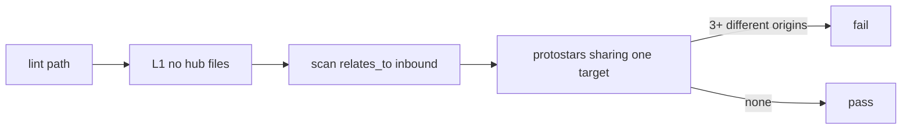

## Intent + scope

Add discuss path **lint**. First rule **L1 no hub files**: a concept page must not act as a connector across disconnected topics (the terminated residuals/open.md failure mode).

Find nodes by type. Edges flow from originating conversations. Folder index.md may list files.

## Non-goals

- Full graph linter suite in this change
- Changing Atlas compile
- Cartograph UI
- Treating reserved index.md as a hub

## Pins

| ID | Pin | Disposition |
|----|-----|-------------|
| L1 | No hub files | Accept (user) |
| L2 | Own path lint, not folded only into sprout | Accept |
| L3 | Reserved index.md / log.md are lists, not hubs | Accept |
| L4 | Terminated stub of a former hub may remain so links do not dangle; no new inbound from protostars | Accept |

## Genesis Artifacts

### Intent + scope + non-goals

See above.

### Diagram



### Interface sketch

```text
path: lint
path_module: references/paths/lint.md
atlas_root: <store>
```

Optional CLI: `python3 scripts/lint.py --root <atlas>`

### Cost note

One grep/parse of frontmatter per lint. Cheap. Run after sprout or from-conversation, not every sentence.

### Acceptance

- paths/lint.md exists and SKILL registry lists it
- L1 defined and checked
- Compile green
- Current store passes L1 after the hub terminate

## Catalogue Review

catalogue_review: n/a — lint path is a local check, not topology/fan-out/B17 change beyond existing Enter card.

## Behavioural contract (agent-spec)

deferred: specify after a later design if lint becomes behavioural-gated.

## Evaluation plan

Deterministic: lint.py exit 0 on discuss Atlas; fail if 3+ protostars inbound-relate to one non-origin catalog page.

## Stop for approval

Captured as implemented in the same turn because the user named the deliverable as the path itself. Scope is L1 only.
