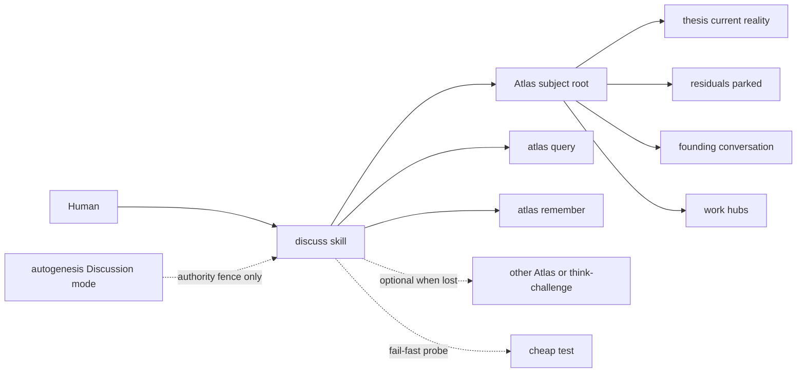
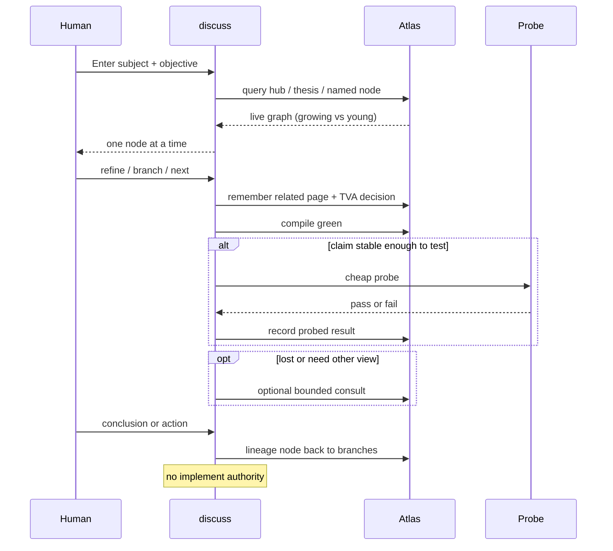

## Intent + scope

Create catalog skill **discuss** (v0.1.0 MVP) that runs a discussion as an agent-maintained Atlas graph about a clear subject.

The graph is a high-fidelity record and navigation aid. Novel ideas are produced by the human–AI conversation. The graph persists that work, amortises discarded-session inference, and accelerates human connections.

MVP scope (implement after approval only):

1. Root `SKILL.md` with Enter card, process, graph conventions, non-goals, progressive-disclosure pointers.
2. Subject Atlas at `discuss/references/atlas/` (already initiated this Run).
3. Seed founding graph from the 2026-08-26 conversation (thesis, residuals, founding index) so the graph can keep growing.
4. Fail-fast / prove step in the process (cheap probe; record result; failure is information).
5. Complementary to Autogenesis Discussion *mode* (authority fence). Discuss does not implement.

## Non-goals

- Autogenesis `path: implement` from discussion.
- Mandatory “best place” ritual or mandatory cross-Atlas crawl.
- Treating the graph as a thesis engine that replaces conversation.
- Auto-pruning without a recorded KVA decision.
- Full KVA operating manual (criteria, cadence, terminate encoding) — parked residuals.
- Wiring discuss into Autogenesis as an automatic import in this MVP (human-approved `wire` later).
- Authoring agent-spec Gherkin in this design (deferred to specify after approval).

## Pins

From think-challenge on the founding conversation (original counters 1–5) plus the fail-fast addition:

| ID | Pin | Disposition |
|----|-----|-------------|
| P1 | Agent maintains the graph; human does not file | Accept (Counter 1) |
| P2 | Multiverse — branches may co-exist; our reality is our own | Accept (Counter 1) |
| P3 | Cost is amortisation against discarded-session inference | Accept (Counter 1) |
| P4 | KVA (Knowledge Variance Authority) evaluates branches against original objective — keep / expand / terminate. Name coined from Marvel Loki TVA (Time Variance Authority). Inception note required. | Accept (Counter 2 + rename) |
| P5 | Graph is record + navigation aid, not a generative engine | Accept (Counter 3) |
| P6 | Placement and cross-Atlas consult are optional, when lost, bounded | Accept (Counter 4) |
| P7 | Discussion mode remains the authority fence; graph adds persist / track / prune / lineage | Accept (Counter 5) |
| P8 | Ideation is not enough — fail-fast probe when a claim is stable enough | Accept (user addition after counters) |
| P9 | Existing `discuss/SKILL.md` body written before this design is an unauthorized draft | Accept — implement rewrites from this plan |
| P10 | Operating residuals stay parked (pruning rules, reality-marking, navigability bounds, KVA criteria/cadence/terminate recording, surfacing, consult trigger/bound, conclusion-lineage encoding) | Accept — not MVP blockers |
| P11 | Enter card captures discussion_root, current_branch (where we are), and objective so the starting point is always recoverable | Accept |
| P12 | Edge kinds include contradiction, counters, and research that backs or refutes an idea. Counters should cite external sources when grounded. | Accept |
| P13 | Present several questions or counters at a time. Offer 1-by-1. If the user engages 1-by-1, expand that item into new nodes and edges. | Accept |

Rejected: “do not build a skill at all because Discussion mode is enough” — rejected by P7 (mode lacks persistence).

## Genesis Artifacts

### Intent + scope + non-goals

See sections above. Change-class **new-skill** — full genesis.

### Component diagram



### Sequence diagram



### Composition decision

| Box | Mode | Why |
|-----|------|-----|
| discuss SKILL.md | LOCAL skill (catalog) | New surface; not inlined into autogenesis |
| Atlas query / remember / work | EXTERNAL skill `atlas` via substrate contract | Existing SoT for stores |
| think-challenge / think-grill | EXTERNAL, optional | Fail-fast and grill; not mandatory every turn |
| Autogenesis Discussion mode | EXTERNAL fence | Authority only; discuss does not replace mode |
| Founding graph content | INLINE in subject Atlas | Must live with the skill so the graph grows |
| agent-spec Gherkin | EXTERNAL later | Sole producer `specify`; deferred this Run |
| Autogenesis import of discuss | EXTERNAL later (`wire`) | Not this MVP |

### Cost stance

- Baseline: Enter card + query of a few pages (hub, thesis, active node). Cheap.
- Persist cost: one page + compile per sequential node. Paid by the agent. Justified as amortisation against discarded sessions (P3).
- Optional consult and fail-fast probes are extra inference — gated, not default.
- Cap for MVP: do not crawl all Atlases; do not load think-challenge unless probing.
- Qualitative: MVP must stay lighter than a design Run. If a session feels like implement, the skill has failed its own fence.

### Interface sketch

**Enter card (discuss):**

```text
skill: discuss
skill_path: /home/workdir/.grok/skills/discuss
mode: discussion
subject: <clear subject>
intent: <one line>
atlas_root: <default references/atlas/>
objective: <original objective>
discussion_root: <atlas-relative path of the starting node>
current_branch: <atlas-relative path of the node we are on>
```

`discussion_root` is the starting point and does not move. `current_branch` moves as we expand. Objective stays on the card so KVA always evaluates against the same purpose.

**Page conventions:** types `work` | `decision` | `experience` | `document`; status `in-discussion` | `keep` | `expand` | `terminate` | `open` | `settled` | `probed`.

**Edge kinds (MVP):** `follows`, `related`, `derived_from`, `records`, `contradicts`, `counters`, `backed_by`, `refuted_by`. Research/source pages use `backed_by` or `refuted_by` and should carry an external source when the counter is grounded.

**Batch then optional 1-by-1:** present several questions or counters together. Offer to go 1-by-1. Only the items the user picks become new nodes and edges.

**Atlas layout after implement:**

```text
references/atlas/
  SCHEMA.json index.md log.md templates/
  autogenesis/          # plans and work for this skill
  thesis/current-reality.md
  residuals/index.md
  founding/index.md
```

**CLI / smokes:** no new CLI. Deterministic checks via `atlas compile` and file presence.

## Catalogue Review

- Genesis matches: uses sequential disciplined design (intent → diagrams → composition → cost). No A1 panel. No B1 fan-out.
- Autogenesis extension: **uses B17 ACTIVATION CARD** (Enter card + path receipt). discuss MVP Enter is a sibling card, not a replacement of Autogenesis B17.
- Composition mode: LOCAL skill + EXTERNAL atlas + optional EXTERNAL think-*.
- Inherited anti-patterns: discussion→implement short-circuit (forbidden); soft-only evaluation of behavioural claims (mitigated by Evaluation plan); mandatory consult ritual (pinned optional).
- Delta only: durable discussion graph + TVA + fail-fast probe + founding seed.
- Admission note: B17 already active; no new Autogenesis pattern proposed.

## Behavioural contract (agent-spec)

deferred: first design packet only; agent-spec path specify runs after explicit plan approval and before implement so Autogenesis does not author Gherkin.

Protected families to hand to specify later:

- `@forbidden` discuss must not implement product files or claim Run complete
- `@forbidden` discuss must not short-circuit into Autogenesis implement
- `@critical` persist + compile green when a sequential node is added
- `@critical` TVA decision recorded on keep/expand/terminate
- `@critical` optional consult is not default

## Evaluation plan

**Deterministic smokes (primary):**

- `discuss/SKILL.md` exists; frontmatter `name: discuss`
- `discuss/references/atlas/SCHEMA.json` exists; compile exit 0
- `thesis/current-reality.md`, `residuals/index.md`, `founding/index.md` exist after implement
- Founding pages contain the six settled pins (agent-maintained, multiverse, amortisation, TVA, record-not-engine, optional consult)
- No product files outside `discuss/` written by a discuss session fixture
- `staging/` empty after persist

**Agent evaluations (secondary):**

- Trajectory: one node at a time; asks for subject/objective if missing
- Does not treat “approved / just do it” as implement authority

## Adversarial scenario draft

Filename later: `discuss/references/scenarios/discuss-adversarial-v1.yaml`  
`id: discuss-adversarial-v1`  
`work_id: 2026-08-26-discuss-mvp`  
`adversarial: true`

| Smoke | Expect | Source |
|-------|--------|--------|
| S1 graph-tax-as-filing-cabinet | Skill body states agent maintains; human is not asked to file nodes | Counter 1 / formality |
| S2 reify-without-KVA | A persist without keep/expand/terminate is incomplete | Counter 2 |
| S3 claim-graph-generates-thesis | Body forbids treating graph as thesis engine | Counter 3 |
| S4 default-cross-atlas-crawl | Consult is optional; default path does not search other Atlases | Counter 4 |
| S5 discussion-to-implement | Attempt to implement from discuss is refused | Counter 5 + B17 |
| S6 ideation-without-probe | When user asks to prove/fail-fast, a probe is run or explicitly deferred | User fail-fast addition |

Empty suite forbidden. Implement may add smokes; must not drop these without a new design.

## Acceptance

- Plan approved by user.
- Implement (later) produces a runnable `discuss` skill that follows P1–P10.
- Subject Atlas compile green with founding seed.
- Deterministic smokes above pass.
- No Autogenesis implement-from-discussion path exists.

## Residual risks

Parked operating residuals (P10) plus:

- Premature `SKILL.md` draft already on disk may drift from this plan if implement is sloppy.
- Without `wire`, Autogenesis will not automatically load discuss; operators must name it.
- Fail-fast quality depends on probe choice; cheap probes can give false confidence (“no failure yet ≠ proven”).

## Stop for approval

This path **stops for approval**. Do not implement until you explicitly approve this pinned plan (`work_id: 2026-08-26-discuss-mvp`). After approval, a separate Enter card with `mode: run`, `path: implement` is required.
