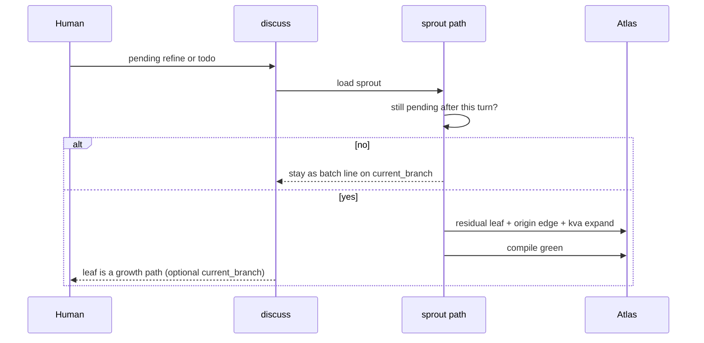

## Intent + scope

Evolve **discuss** so open refinements and todos are first-class graph leaves, not a list on a catalog page.

Core rule: anything still pending to refine, decide, probe, or do — that belongs to a discussion — becomes a page with `type: residual`, `status: open`, `kva: expand`, `growth: true`, and a required edge to the **originating conversation node**.

Give this its own activation path **sprout** (`references/paths/sprout.md`). Live discuss and `from-conversation` both call sprout when they park work rather than invent a second filing habit.

In scope after approval:

- Path module `sprout`
- SKILL.md process step + path registry row
- Required origin edge convention
- KVA gate so not every mutter becomes a leaf
- Adversarial smokes for flood, orphans, and implement-via-leaf

Out of scope: Autogenesis wire, full KVA operating manual, Cartograph layer changes, converting Autogenesis work hubs into residuals.

## Non-goals

- Turning discuss into a general todo app
- Auto-implement from a residual leaf
- Mandatory leaf for typos, card-field nits, or one-line clarifications that die in the same turn
- Moving residuals out of the subject Atlas

## Pins

| ID | Pin | Disposition |
|----|-----|-------------|
| P1 | Pending refine/todo in a discussion becomes a growth node | Accept (user: core discipline) |
| P2 | Every leaf `relates_to` the originating conversation node (`derived_from` or `follows`) | Accept (user: must trace origin) |
| P3 | Own path `sprout`, not folded only into from-conversation | Accept |
| P4 | Batch first; persist a leaf only when the item survives the turn as still-pending | Accept — answers Counter 1 flood |
| P5 | KVA on every leaf at birth (`expand` default for real pendings; `terminate` if parked-as-closed) | Accept |
| P6 | Catalog page (`residuals/open.md` or hub batch list) may index leaves; it is not a substitute for leaves | Accept |
| P7 | A leaf is not implement authority | Accept (Counter 5 fence) |
| P8 | Existing 11 residual-typed pages stay until implement; sprout migrates them to protostar and back-fills origin edges | Accept |
| P9 | Schema type is `protostar`. Not residual, not leaf. Forming star on the Atlas sky. Path that creates them stays `sprout` unless a later pin renames the path. Kinds stay a field (`leaf_kind` or `star_kind`: refine, question, counter, probe, tension, action). | Accept (user pin 2026-08-26) |

Rejected: “list on one page is enough” — rejected; that hid growth paths.  
Rejected: “every sentence is a leaf” — rejected; recreates the maintenance tax.  
Rejected: type name `residual` — too much like scrap.  
Rejected: type name `leaf` — tree metaphor, not Atlas/sky.

## Genesis Artifacts

### Intent + scope + non-goals

See above. Change-class **new-surface** — mini-genesis.

### Diagram



### Interface sketch

**Enter extras when sprouting:**

```text
path: sprout
path_module: references/paths/sprout.md
origin_node: <atlas-relative page that originated the pending>
```

**Leaf frontmatter (required):**

- `type: protostar`
- `status: open`
- `kva: expand`
- `growth: true`
- `relates_to: [{path: <origin_node>, kind: derived_from}]`

**Find:** `atlas search "growth: true"` (not prose search for `type: residual`).

### Cost note

One page + compile per pending that survives the turn. Cheaper than losing the todo in a discarded session. More expensive than a bullet on the parent — that cost is the point only when the item will be a future `current_branch`.

### Acceptance

- Path `sprout` exists and SKILL registry points at it
- Live discuss and from-conversation instruct: park via sprout
- New residuals have origin edges
- Flood and orphan smokes exist
- Compile green
- No implement from a leaf

## Catalogue Review

- Genesis: sequential discipline; no panel, no fan-out
- B17: sprout is a discuss path; Enter card already required; add `path` + `origin_node`
- Composition: LOCAL path module under discuss; EXTERNAL atlas remember/compile
- Anti-patterns inherited: filing-cabinet flood (P4); discussion→implement via leaf (P7)
- Delta: residual type as core growth surface + sprout path + required origin edge
- Admission: no new Autogenesis pattern

## Behavioural contract (agent-spec)

deferred: specify after approval and before implement. Families to hand over:

- `@critical` pending that survives a turn becomes a residual leaf
- `@critical` leaf relates_to originating conversation node
- `@forbidden` leaf without origin edge
- `@forbidden` every utterance persisted as a leaf
- `@forbidden` implement product files because a residual exists

## Evaluation plan

Deterministic primary:

- `references/paths/sprout.md` exists
- SKILL.md registry lists sprout
- New residual pages have `type: residual` and a `relates_to` path under `founding/` or the named origin
- `growth: true` search returns those leaves
- compile green

Agent secondary: when user says “park this / todo / refine later”, agent loads sprout rather than only appending a bullet.

## Adversarial scenario draft

`discuss/references/scenarios/discuss-sprout-adversarial-v1.yaml`

| Smoke | Expect | Source |
|-------|--------|--------|
| S1 leaf-flood | Path forbids a leaf per utterance; batch first | Counter 1 |
| S2 orphan-leaf | Persist incomplete without origin relates_to | User origin rule |
| S3 leaf-is-implement | Residual must not grant implement authority | Counter 5 |
| S4 catalog-not-enough | A bullet-only park when item survives the turn is incomplete | User core-discipline |
| S5 missing-kva | New leaf without kva is incomplete | KVA pin |

## Residual risks

- Grep search still noisy for `type: residual`; operators must use `growth: true` until search understands frontmatter types
- Origin node may be the hub when the true parent is unclear — allowed, but weaker lineage
- sprout could drift from from-conversation if both park differently — plan requires from-conversation to call sprout

## Stop for approval

This path **stops for approval**. Do not implement until you explicitly approve `work_id: 2026-08-26-discuss-sprout-leaves`.
