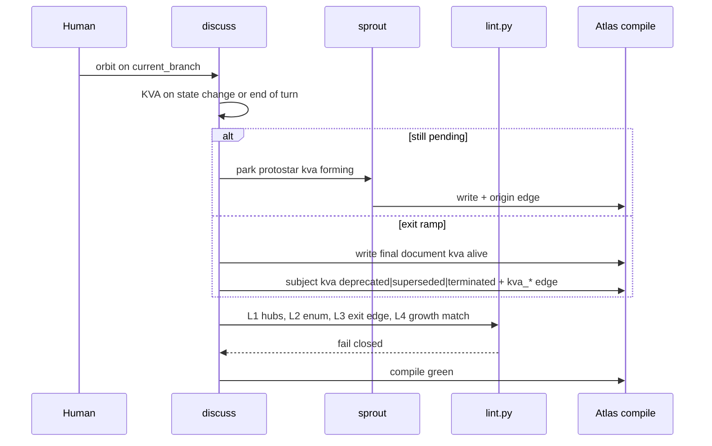
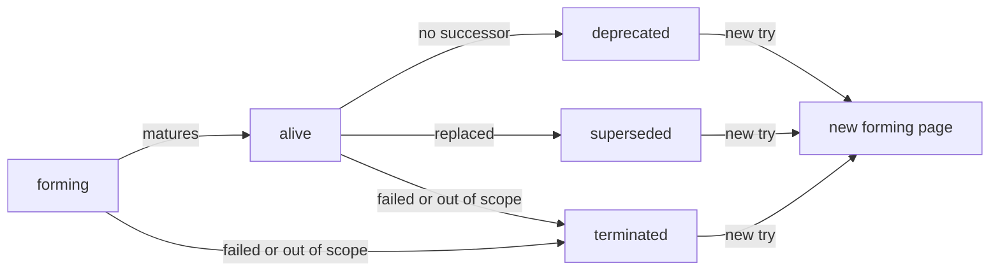

## Intent + scope

Evolve **discuss** so KVA is one field with five values, growth is what alive nodes do, and deprecate / supersede / terminate are graph exits that require a final-reason node.

In scope after approval (subject = discuss only):

- `SKILL.md` process step 6 + graph conventions (enum, edges, protostar invariant)
- `references/paths/sprout.md` birth defaults
- `references/paths/lint.md` + `scripts/lint.py` rules L2–L6
- Subject `SCHEMA.json` + protostar / document templates
- One-shot migration of existing discuss Atlas pages off legacy `keep|expand|terminate`
- New adversarial suite file `discuss-kva-adversarial-v1.yaml` (keep prior suites)
- Discuss version `0.2.1` → `0.3.0`

Out of scope: Autogenesis product files, construct runtime changes, agent-spec Gherkin in this Run, Cartograph, wiring, inventing a sixth `expand` state, deleting terminated/deprecated/superseded pages.

## Non-goals

- Discussion → implement
- New catalog skill
- New Atlas `type` for the final node (use `document` + `kva_role: exit-reason`)
- Embedding `kva_reason` text on the subject
- Treating `status` as a second KVA enum
- Auto-unmute of an exit stub

## Pins

| ID | Pin | Disposition |
|----|-----|-------------|
| P1 | `kva` values: `forming` \| `alive` \| `deprecated` \| `superseded` \| `terminated` | Accept (user 2026-08-26) |
| P2 | Rename `active` → `alive`. Alive nodes may grow forming children. | Accept |
| P3 | No sixth `expand` state. Mature-but-growing = alive parent + forming children. | Accept (user accepted no-sixth) |
| P4 | `type` and `star_kind` stay off the KVA enum. A protostar is usually forming; it may be an exit stub. | Accept |
| P5 | Exit ramps `deprecated` \| `superseded` \| `terminated` require a final node. Subject → final node with `kva_deprecate` \| `kva_supersede` \| `kva_terminate`. | Accept |
| P6 | Final node is `type: document`, `kva_role: exit-reason`, `kva: alive`. Same-event fan-in allowed. Generic catalog reason is L1. | Accept (closes protostar-final-node-type this design) |
| P7 | No reason string on the subject. | Accept |
| P8 | Reactivation = new forming page `derived_from` the stub. Stub does not flip. | Accept |
| P9 | Default growth search = `kva: forming` (and `growth: true` must match). Exit states must have `growth: false` or omit growth. | Accept |
| P10 | `status` remains a *page-process* field (`in-discussion` \| `probed` \| `settled` \| `open`). It MUST NOT repeat KVA values (`keep`, `expand`, `terminate`, `done`, `alive`, …). | Accept (keeps probe/settled without a sixth KVA) |
| P11 | Cadence: write `kva` when the branch *changes state*, and on `current_branch` at end of turn. Not every typo persist. | Accept |
| P12 | Value test: a branch has value iff it moves the locked `objective` on the discussion_root toward a usable distinction (keep as alive, grow forming children, or record an exit with a final node). Idle decoration is terminate. | Accept |
| P13 | Implement migrates existing pages in the same Run. Legacy `kva: expand` on protostars → `forming`; on conversation experiences → `alive`. `keep` → `alive`. `terminate` → `terminated` plus one shared historical final node. | Accept |
| P14 | New `relates_to` kinds are discuss-lint validated. Atlas compile does not need a closed global kind enum. | Accept |
| P15 | agent-spec `specify` deferred until after approval. | Accept |

Rejected: sixth state `expand`.  
Rejected: in-place `terminated → forming`.  
Rejected: `obsolete` as a KVA value.  
Rejected: `kva_reason` scalar field.

## Genesis Artifacts

### Intent + scope + non-goals

See above. Change-class **new-surface** — mini-genesis.

### Diagram





The dashed reactivation path is always a **new page**. Old node stays on its exit value.

### Interface sketch

**SCHEMA.json** (discuss subject only) gains:

```json
"kva": {
  "field": "kva",
  "values": ["forming", "alive", "deprecated", "superseded", "terminated"],
  "required_on_types": ["protostar"],
  "recommended_on_types": ["experience", "decision", "document", "work"],
  "legacy_values_forbidden_after_migrate": ["expand", "keep", "terminate", "done", "active"]
},
"kva_role": {
  "values": ["exit-reason"],
  "when": "document that is the target of kva_deprecate|kva_supersede|kva_terminate"
},
"relation_kinds_added": ["kva_deprecate", "kva_supersede", "kva_terminate"],
"templates": {
  "protostar": {
    "frontmatter": {
      "required": ["type", "title", "created", "kva", "status"],
      "recommended": ["reality", "growth", "star_kind", "description"]
    }
  },
  "document": {
    "recommended_extra": ["kva", "kva_role"]
  }
}
```

Required keys on protostar stay ≤ 8 (simplicity budget).

**lint.py** additions (discuss-owned graph law, not Atlas compile):

| ID | Rule |
|----|------|
| L1 | unchanged — no hub files |
| L2 | `kva` if present ∈ five values |
| L3 | protostar requires `kva` |
| L4 | `deprecated\|superseded\|terminated` ⇒ exactly one matching `kva_*` edge to a page with `kva_role: exit-reason` and `kva: alive` |
| L5 | `growth: true` only when `kva: forming` |
| L6 | terminated/deprecated/superseded stubs collect no *new* protostar inbound except `derived_from` reactivation children |

**sprout birth:** `type: protostar`, `kva: forming`, `status: open`, `growth: true`, origin `derived_from`.

**SKILL.md:** replace keep/expand/terminate language; document five values; document final-node rule; search instruction becomes `kva: forming` (keep `growth: true` as the matching index flag).

**Migration table**

| Legacy | New |
|--------|-----|
| protostar + `kva: expand` / missing kva | `kva: forming`, `growth: true` |
| experience/decision/work + `kva: expand` or `keep` | `kva: alive` |
| `kva: terminate` | `kva: terminated` + edge to `kva-tighten/reasons/historical-migration.md` |
| `status` values that are KVA words | rewrite status to page-process only |

### Cost note

One implement Run on discuss only. Extra tokens: lint extension + mechanical frontmatter rewrite of the existing discuss Atlas (tens of pages, not hundreds). No new model class. Stance: balanced. No premium fan-out.

## Catalogue Review

- genesis matches: none by id; control layer is domain KVA, not a new genesis primitive
- Autogenesis extension: **B17** already on discuss Enter card — refine in place (card keeps `objective`; KVA evaluates against it)
- composition: **INLINE** in discuss (SCHEMA + lint + sprout). No sibling skill.
- inherited anti-patterns: dual status fields (addressed by P10); discussion→implement (unchanged fence)
- delta only: enum, three edge kinds, lint L2–L6, templates, migration
- admission: not a new genesis pattern

## Behavioural contract (agent-spec)

`deferred: specify after approval so b-IDs bind to the pinned five-value enum and L2–L6, not the pre-design discussion graph.`

Protect in specify (when it runs):

- `@forbidden` in-place unmute of an exit stub
- `@forbidden` discussion→implement
- `@critical` missing `kva_*` edge on an exit ramp
- `@critical` protostar without `kva`

## Evaluation plan

Deterministic primary:

- `atlas compile --root discuss/references/atlas` exit 0
- `python3 discuss/scripts/lint.py --root …` exit 0 after migrate
- no page carries legacy `kva: expand|keep|terminate|done|active`
- every protostar has `kva`
- every `kva` in {deprecated, superseded, terminated} has matching edge
- every `growth: true` page has `kva: forming`
- construct smokes in `discuss-kva-adversarial-v1.yaml`

Agent evaluations secondary: trajectory “did the agent mint a final node instead of a reason string” — not sole evidence.

## Adversarial scenario draft

Filename at implement: `discuss/references/scenarios/discuss-kva-adversarial-v1.yaml`

```yaml
id: discuss-kva-adversarial-v1
work_id: 2026-08-26-kva-protostar-tighten
adversarial: true
packages: [discuss]
smokes:
  - id: sixth-expand-state
    source: "kva-tighten/no-sixth-expand.md"
    expect: "SKILL and SCHEMA list exactly five kva values; expand is not one of them"
  - id: reason-string-on-subject
    source: "user pin P7"
    expect: "no kva_reason field in SCHEMA or templates; lint does not treat a body heading as the exit edge"
  - id: missing-exit-edge
    source: "IESG Historic without why / P5"
    expect: "lint L4 red when deprecated|superseded|terminated lacks matching kva_* edge"
  - id: unmute-in-place
    source: "git restore is a new ref / P8"
    expect: "SKILL forbids flipping terminated|deprecated|superseded to forming on the same path"
  - id: growth-lie
    source: "KCS archive leaves default search / P9"
    expect: "lint L5 red when growth true and kva is not forming"
  - id: catalog-reason-hub
    source: "L1 + user same-event fan-in"
    expect: "a generic reasons/open catalog that many unrelated exits point at fails L1"
  - id: enum-unknown-after-migrate
    source: "GraphQL/Avro enum evolution — old symbols break readers"
    expect: "implement Run leaves zero legacy kva symbols on discuss Atlas pages"
  - id: leaf-is-implement
    source: "discuss-sprout-adversarial leaf-is-implement"
    expect: "final node and forming protostar still grant zero implement authority"
```

Keep `discuss-adversarial-v1.yaml` and `discuss-sprout-adversarial-v1.yaml`. Do not drop smokes.

## Acceptance

1. SCHEMA documents the five values, required `kva` on protostar, added relation kinds, `kva_role`.
2. lint L2–L6 implemented and green on the migrated store.
3. SKILL + sprout use forming/alive/deprecated/superseded/terminated only.
4. Existing discuss Atlas migrated; compile green; no legacy kva symbols.
5. New adversarial file present; prior suites retained.
6. Version 0.3.0 on discuss SKILL.md.
7. No Autogenesis product edits.

## Residual risks

- Historical `terminate` pages may lack a real reason; the shared migration final node is a stub, not reconstructed history.
- Atlas search `growth: true` remains grep text; BM25 later may need a field index.
- `status` and `kva` still coexist; P10 is prose discipline plus lint only if we add L7 later.
- agent-spec specify is deferred; G-BDD incomplete until that path runs.

## Stop for approval

This path **stops for approval**. Do not implement SKILL, SCHEMA, lint, or migration until the user explicitly approves this plan.

Approve with: approve plan `2026-08-26-kva-protostar-tighten` (optionally “implement next”).
