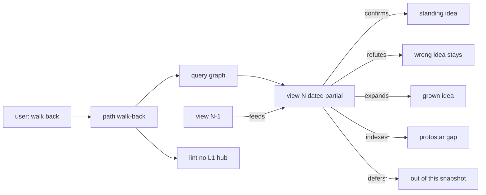

## Intent + scope

Add a **discuss** activation path **`walk-back`** that writes a **partial consolidate view** of an existing graph at a point in time. Several views may exist on one path as ideas mature. A later view may `feeds` / `derived_from` an earlier view. Each edge from the view to an idea names the **stance of this snapshot** (confirm, refute, expand, …). Wrong ideas stay in the graph; KVA is not deleted by a view.

In scope: path module, SKILL registry row, trigger phrases, page contract, edge rules, lint note.

Out of scope this path: implementing Atlas CLI verbs; changing Autogenesis except a one-line “may call discuss walk-back”; agent-spec Gherkin (deferred until approval).

## Non-goals

- Replace `from-conversation` (ingest) or `lint` (discipline check).
- Auto-run walk-back every turn.
- Force `derived_from` from every protostar to the view.

## Genesis Artifacts

### Component (mermaid)



### Interface sketch

Triggers: `walk back`, `consolidate view`, `picture of the pieces`, `gaps and contradictions`.

Enter extras:

```text
path: walk-back
path_module: references/paths/walk-back.md
discussion_root: <existing hub>
view_page: <slug>/consolidate-<YYYY-MM-DD>-<slug>.md
prior_view: <optional earlier view>
```

Procedure (draft):

1. Query hub and existing consolidate views on this `discussion_root`.
2. Write a **new** view page (do not silently overwrite an earlier snapshot unless the user says refresh-this-file).
3. For every idea in scope, put one stance edge on the view (vocabulary below). Protostars: `indexes` or `defers` only — and lint must treat those kinds as **not** L1 shortcuts, or keep protostars body-only until lint learns `indexes`.
4. If a prior view exists, `derived_from` + `feeds` from prior → new.
5. `current_branch` = this view. Compile + lint.
6. Chat: picture, what was confirmed / refuted / expanded, gaps, contradictions.

### Cost note

One Atlas query pass + one page rewrite per call. Cheaper than re-ingesting the conversation. Do not walk-back on every discuss turn.

## Consolidation stance vocabulary

Two layers must not be mixed:

- **KVA** on a page = fitness of that memory in the graph (`forming` / `alive` / …). A refute in a view does **not** terminate the page.
- **Stance edge** on a consolidate view = what *this snapshot* does to that memory.

Closed list (view → idea), all new except where noted:

| Kind | What this view does to the idea |
|------|----------------------------------|
| `confirms` | Takes it as standing in this snapshot (lock or lean). |
| `refutes` | Rejects it *here*. Page stays; may still be `kva: forming` or even `alive` as a discarded branch. |
| `expands` | Grows or re-scopes it; the idea is still the origin. |
| `restates` | Same claim, tighter wording on the view. |
| `indexes` | Navigation only. Default for protostar gaps. No truth claim. |
| `defers` | Known, out of this snapshot’s claim set. |
| `absorbs` | Folded into another idea named on the same view (target is the surviving page). |
| `feeds` | View → later view. This snapshot is input to the next consolidation. |

Keep existing graph kinds for idea↔idea (not view-specific): `follows`, `related`, `derived_from`, `records`, `contradicts`, `counters`, `backed_by`, `refuted_by`, KVA ramps.

Do not use `records` as a substitute for `confirms`. Do not use KVA `terminated` because a view refuted an idea.

## Pinned decisions

- **P1** New path `walk-back`, not a mode of `from-conversation`. Ingest ≠ synthesise.
- **P2** A view is a **partial, dated** index, backwards over the graph. Many views per `discussion_root`. Filename `consolidate-YYYY-MM-DD-slug.md`.
- **P3** Default off. User- or Autogenesis-requested only.
- **P4** Idea↔idea `contradicts` / `counters` stay on those pages. The view may `confirms` one side and `refutes` the other without deleting either.
- **P5** No implement of discuss SKILL.md until approval.
- **P6** Stance vocabulary above is closed until discuss SCHEMA adds the kinds. Lint L1 must ignore `indexes` / `defers` / `refutes` from views, or views must not edge protostars until that lint change ships **with** this path.
- **P7** Later views `feeds` from earlier views. Graphs are allowed to keep wrong ideas.

## Counters (think-challenge, internal)

- C-a: “Just extend from-conversation.” Rejected — that path extracts turns; walk-back reads an already-built graph.
- C-b: “Link every leaf to the view.” Rejected — L1 hub; false `derived_from`.
- C-c: “Run every session.” Rejected — cost + stale current_branch churn.
- C-d: “Put walk-back only in Autogenesis.” Rejected — the useful loop is discuss itself; Autogenesis already delegates `path: discuss`.

## Acceptance

- Path file exists and is in the discuss registry.
- Trigger phrases listed in SKILL progressive disclosure.
- A second walk-back on the same hub creates a **new** view (or refreshes only if the user names the file).
- Each idea in the view body is paired with a stance kind.
- Lint L1 does not fire on a view that `indexes` ≥3 protostars (requires lint change in the same implement slice).
- Chat names what was confirmed, refuted, expanded, deferred.

## Stop

This path **stops for approval**. Implement only after you accept P1–P7.
---
